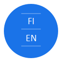
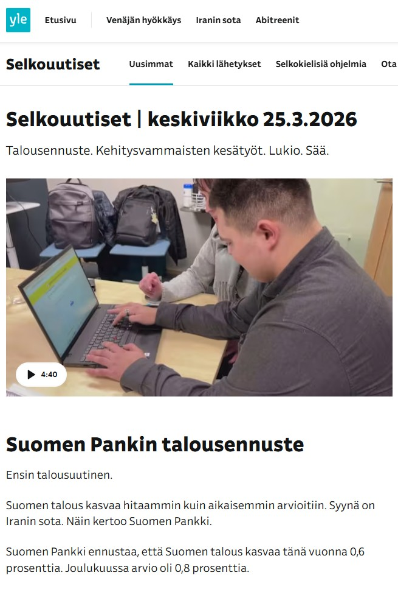
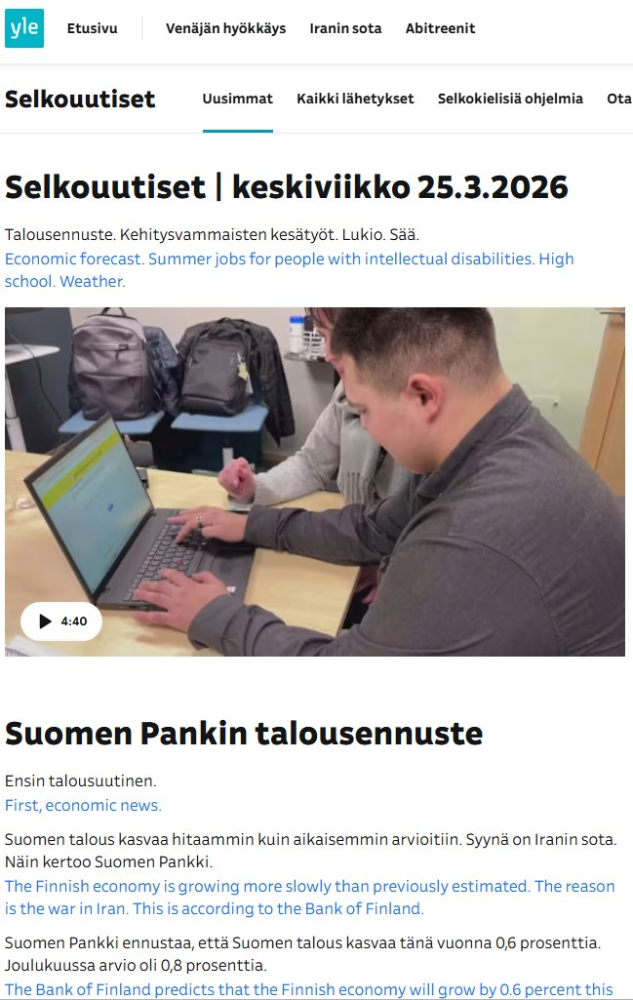

# Selkouutiset Line Translator

A Chrome extension that translates Finnish Selkouutiset (easy Finnish news) to English.



## Features

- 🔄 Translates Yle Selkouutiset pages
- 📝 Inserts English translation below each paragraph
- 🚀 Uses Google Translate API for accurate translations
- ⚡ Fast and lightweight

## Screenshots

### Before Translation



_Original Selkouutiset article in Finnish_

### After Translation



_English translations inserted below each paragraph_

## Installation

**Clone this repository**
git clone https://github.com/dalu810/selkouutiset-line-translator.git

## Get a Google Translate API key

- Go to Google Cloud Console
- Create a new project or select existing
- Enable Cloud Translation API
- Create credentials (API Key)
- Configure the extension

## Copy the example config

cp config.example.js config.js
Edit config.js and add your API key
Replace YOUR_API_KEY_HERE with your actual API key

## Load the extension in Chrome

- Open Chrome and go to chrome://extensions/
- Enable "Developer mode" (toggle in top right)
- Click "Load unpacked"
- Select this folder

## Usage

- Navigate to any Selkouutiset article on yle.fi/selkouutiset
- Click the extension icon in Chrome toolbar
- Click "Line Translation" button
- English translations will appear below Finnish paragraphs

## File Structure

```
selkouutiset-line-translator/
├── images/
│ ├── icon-16.png
│ ├── icon-48.png
│ ├── icon-128.png
│ ├── screenshot-before.jpg
│ └── screenshot-after.jpg
├── src/
│ ├── content.js # Main translation logic
│ ├── popup.js # Popup controller
│ └── popup.html # Popup UI
├── manifest.json # Extension config
├── config.js # Your API key (not committed)
├── config.example.js # API key template
└── README.md
```

## Privacy

- API key stored locally in config.js
- Translations sent to Google Translate API
- No user data collected

## License

MIT License
